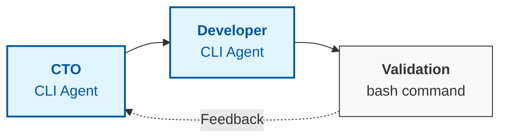

<div align="center">
  
  <p><i>Watch AgentsLoop CLI in action</i></p>

[](https://github.com/Thomas97460/AgentsLoop-CLI/actions/workflows/ci.yml)
[](https://github.com/astral-sh/ruff)
[](https://github.com/Thomas97460/AgentsLoop-CLI/actions/workflows/ci.yml)
[](https://www.python.org/downloads/)

**Autonomous orchestration for software engineering workflows.**

</div>

AgentsLoop CLI is an orchestrator for autonomous agent loops. It coordinates a three-node loop (CTO, Developer, and Validation) to automate software engineering tasks.

## 🔄 The Loop: How it Works



## Key Features

- **Autonomous Loop**: CTO plans, Developer implements, and Validation tests.
- **Multi-Provider Support**: Seamlessly switch between Gemini, Codex, and Copilot.
- **No API Key Required**: Works with your existing provider subscriptions via their respective CLIs.
- **TUI Interface**: Terminal user interface to monitor workflows in real-time.
- **Git Integration**: Works directly within your repositories, creating isolated branches for safety.
- **Coming Soon**: Support for Claude Code.

## Installation

### With uv

```bash
uv tool install git+https://github.com/Thomas97460/AgentsLoop-CLI.git
```

### Without uv

```bash
curl -fsSL https://raw.githubusercontent.com/Thomas97460/AgentsLoop-CLI/main/install.sh | bash
```

### Prerequisites

- Python 3.12 or newer.
- At least one of `gemini`, `codex`, or `copilot` CLI installed and authenticated.

## Usage

```bash
cd ~/your_git_repository/ && agentsloop
```

## Contributing

We welcome contributions! Please check [CONTRIBUTING.md](CONTRIBUTING.md) and [AGENTS.md](AGENTS.md) for development guidelines.

```bash
uv sync --dev
uv run pytest
```
